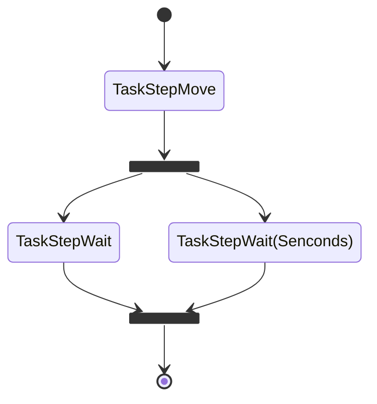
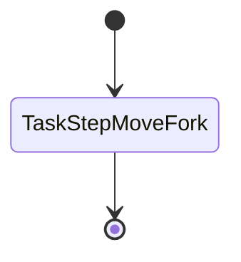
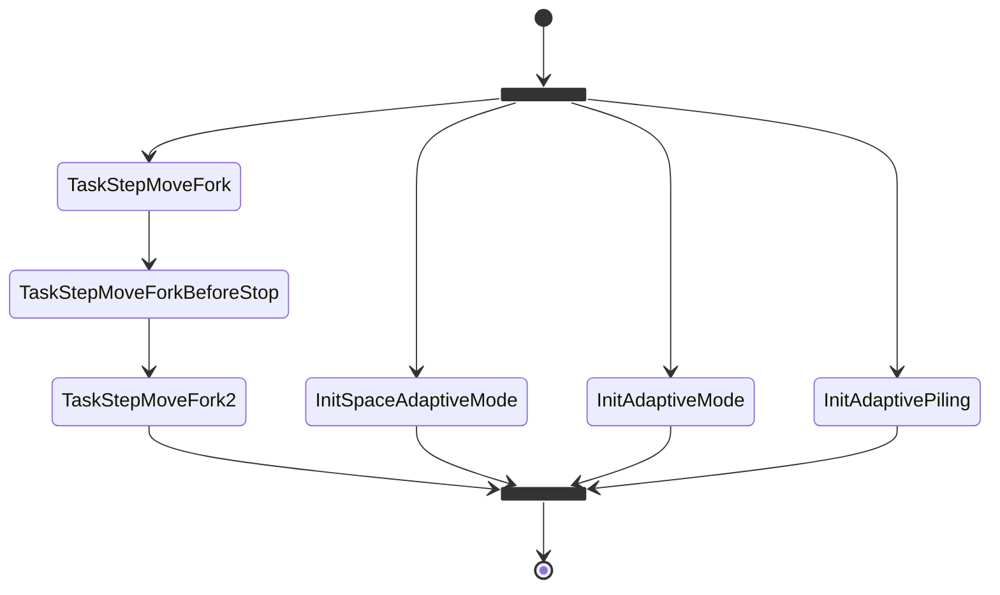

### 使用工作流引擎改进AGV

------

**当前的痛点：**

- 支持的任务步非常有限，需求变更则需要扩展代码，重新编译，或者添加新的任务步
- 工作流固化在代码中，而工作流变化非常快，代码满足不了变化的需求
- 参数本地化只能修改固定任务步的输入参数，无法调整任务步的顺序和更改流程
- 各种车型重复的流程太多，每次改动一个部分，需要重复修改很多地方，而且容易出错
- 划分的任务步粒度不够细，各种业务逻辑胶合在代码中

**工作流的好处：**

- 我们只需要定义好所有的任务步

- Agv执行的流程不在写在代码里面，而是交给现场人员和业务专家

- 业务人员可以根据需求灵活的配置任务流程和参数

- 可以适应大部分需求的变化，只需要修改流程配置文件即可

- 后期可以提供可视化界面，方便业务人员操作

- 写好的流程可以保存，分享，重播

- 可以大大减少现场的问题，同时提高排查相关任务问题的速度

- 可以大大减少代码的修改，开发可以抽出时间做更有价值的事

- 即便前期任务步定义不够充分，需要修改和扩展，也可以非常迅速和方便

- 可以提取工作流引擎模块，可以快速的扩展自动化相关业务

  只要是重复的，需求变化不可控的，有一定执行顺序和规则的业务，都可以直接复用工作流引擎

- 部分任务可以并行处理

- 可以比较细微的控制流程

**缺点：**

- 架构比之前复杂了
- 性能可能会有微小的下降
- 用开源的引擎可能会有一些过度设计

**需要的资源和可能的工作**

- 1 junior dev / 6 month
- 细化任务步（必须业务专家参与）
- workflow engine 整合
- 可能需要引入规则引擎扩展
- 支持的脚本语言（`json`, `yaml`)
- 流程模型
- 未来支持图形化流程编写
- 任务和步骤持久化

**AGV的工作流建模（简单示例）**

任务步暂时使用现有定义的

`TaskMove`子流程：



伪代码：

``` python
async def flow():
    await task('TaskStepMove')
    await fork_and_merge(
        seq(task('TaskStepWait'),
        seq(task('TaskStepWait', 60),
    )
    await task('TaskMove')
```

`TaskMoveLift`:



`TaskPutOfCounterBlanced`:（这里可以考虑直接建立4个流程）



------

**设计细节**：

- 每个任务步完成的时候考虑发送一个事件
- 任务步的划分需要简单、原子
- 
