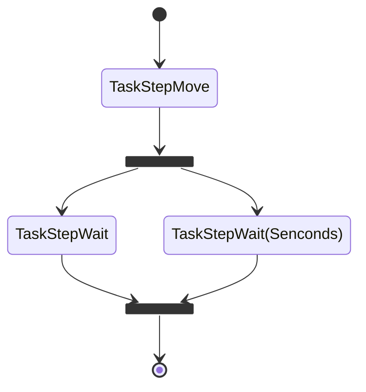
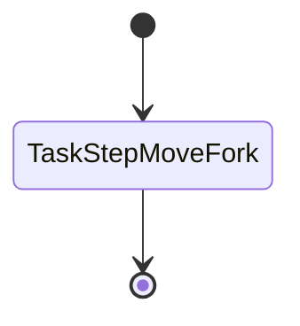
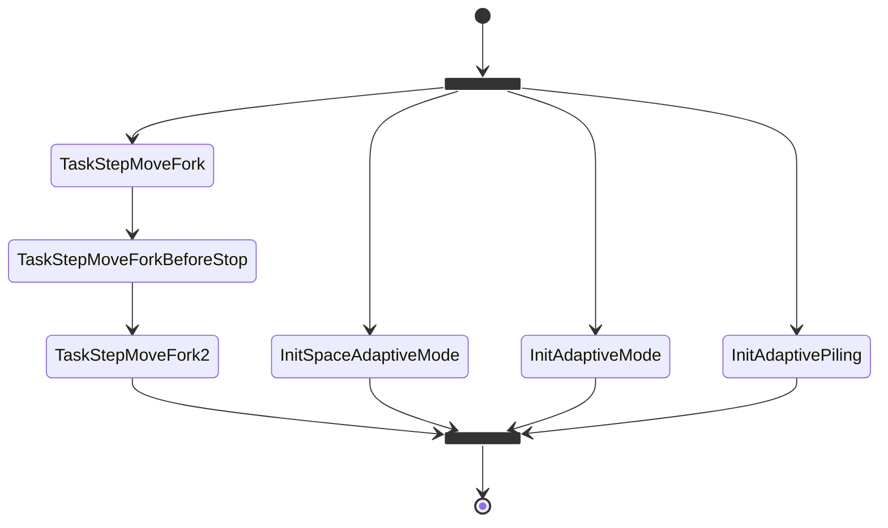

### 使用工作流改进AGV

AGV的工作流建模

这个是`TaskMove`子流程：



代码就很简单了：

``` python
async def flow():
    await task('TaskStepMove')
    await fork_and_merge(
        seq(task('TaskStepWait'),
        seq(task('TaskStepWait', 60),
    )
    await task('TaskMove')
```

`TaskMoveLift`:



`TaskPutOfCounterBlanced`:



