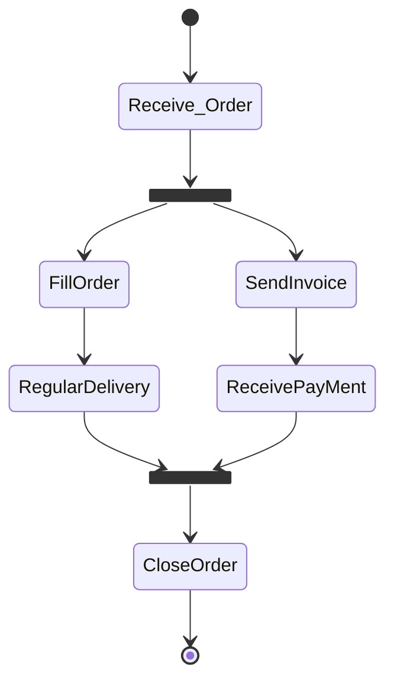

### 工作流引擎实现

简易工作流建模(如下图所示)

- 开始/结束
- 单个任务
- 箭头，表示任务执行的先后顺序（或表示任务的依赖关系）
- 分叉/合并（fork/merge）



建模如下：

``` python
import asyncio as aio

info = print  # or better, info = logger.info

async def seq(*coros):
    results = []
    for coro in coros:
        results.append(await coro)
    return tuple(results)

async def fork_and_merge(*coros):
    return await aio.gather(*coros)

async def task(todo):
    info(f"Doing task: {todo}")
    await aio.sleep(1)
    return todo
```

其中：

- `seq`代表顺序执行；
- `fork_and_merge`代表并行，以及同步并行任务的结果集合；
- `task`代表一般的单个任务；

于是我们可以这样描述该图的工作流定义：

``` python
async def flow():
    await task('Receive Order')
    await fork_and_merge(
        seq(task('Send Invoice'),
            task('Receive Payment')),
        seq(task('Fill Order'),
            task('Regular Delivery'))
    )
    await task('Close Order')
```

C# 版本: (感觉不太对)

``` C# 
async Task Flow() {
    await task('Receive Order');
    await fork_and_merge(async ()=>{
        await seq(async ()=> {
            await task('Send Invoice');
            await task('Receive Payment');
        });
        await seq(async ()=> {
            await task('Fill Order');
            await task('Regular Delivery');
        });
    })
}

```

有了工作流定义，我们随时可以构建一个工作流的实例并执行之：

``` python
loop = aio.get_event_loop()
loop.run_until_complete(flow())

# output
Doing task: Receive Order
Doing task: Send Invoice
Doing task: Fill Order
Doing task: Receive Payment
Doing task: Regular Delivery
Doing task: Close Order
```

子流程：

``` python
async def process_order_subflow():
    order = await get_filled_order()
    if order.is_rush:
        return await task('Overnight Delivery')
    else:
        return await task('Regular Delivery')

async def flow():
    await task('Receive Order')
    await fork_and_merge(
        seq(task('Send Invoice'), 
            task('Receive Payment')),
        process_order_subflow())
    await task('Close Order')
```

> 附：假设项目代码业务模型Order相关功能定义如下：

```python
from dataclasses import dataclass

@dataclass
class Order:
    is_rush : bool
    # maybe define other properties

async def get_filled_order():
    await aio.sleep(2)  # simulate user interaction
    return Order(bool(random.randint(0, 1)))
```

上述工作流的实例仅仅反映了动态图中描述的抽象结构，并未考虑到实例参数化问题。设想一个很简单的场景，我们对每一个申请交互的用户创建一个可辨识的工作流实例。于是我们需要给flow声明一个参数，传入一个用户名作为上下文。这时我们希望：

- 该工作流实例的每个子工作流/子任务都可以访问这个上下文；
- 但我们不希望修改这些子工作流/子任务的签名，并总是自顶向下地显式传入这个上下文对象，这样带来大量重复代码；

可以这样修改代码支持：

```python
# add parameter `user`, which makes better sense in general
async def get_filled_order(user):
    info(f'Retrieving order for {user}')
    await aio.sleep(2)  # simulate user interaction
    return Order(bool(random.randint(0, 1)))

# ...

from contextvars import ContextVar

# declare context var external to the tasks
user_ctx_var = ContextVar('user')

async def task(todo):
    # add logging of context var
    info(f"Doing task: {todo} ({user_ctx_var.get()})")
    await aio.sleep(1)
    return todo

async def process_order_subflow():
    order = await get_filled_order(user_ctx_var.get())
    if order.is_rush:
        return await task('Overnight Delivery')
    else:
        return await task('Regular Delivery')

async def flow(user: str):
    user_ctx_var.set(user)
    await task('Receive Order')
    await fork_and_merge(
        seq(task('Send Invoice'), task('Receive Payment')),
        process_order_subflow())
    await task('Close Order')
```

运行以下代码可以观察到结果——不同的flow实例，子任务获取到了不同的上下文：

``` python
async def main():
    await aio.gather(
        flow('Sam'),
        flow('Joe'),
        flow('Alice'),
    )

loop.run_until_complete(main())


# output
Doing task: Receive Order (Sam)
Doing task: Receive Order (Joe)
Doing task: Receive Order (Alice)
Doing task: Send Invoice (Sam)
Retrieving order for Sam
Doing task: Send Invoice (Joe)
Retrieving order for Joe
Doing task: Send Invoice (Alice)
Retrieving order for Alice
Doing task: Receive Payment (Sam)
Doing task: Receive Payment (Joe)
Doing task: Receive Payment (Alice)
Doing task: Overnight Delivery (Sam)
Doing task: Overnight Delivery (Joe)
Doing task: Regular Delivery (Alice)
Doing task: Close Order (Sam)
Doing task: Close Order (Joe)
Doing task: Close Order (Alice)
```

[^**但是这个上下文只全局的，如何只针对单个任务设置呢？**]: 


- 分叉子进程的存在性是可以依赖于上下文
- 分叉结构可以递归存在

为支持第一条，我们可以调整fork_and_merge方法，过滤掉None值（代表被上下文决定丢弃的任务），并应用之：

``` python
# ...

async def fork_and_merge(*coros):
    results = await aio.gather(
        *filter(lambda x: x is not None, coros))
    return results


# ...

def in_mood_for_wine(table):
    good_mood = len(table) & 1 == 0  # simulate random mood
    info(f'In good mood: {good_mood}')
    return good_mood

async def service(todo):
    info(f'Service doing: {todo}')
    await aio.sleep(random() * 3)
    return todo

async def serve_meal(table):
    return await (
        fork_and_merge(
            seq(
                fork_and_merge(
                    service('Cook Spaghetti'),
                    service('Mix Carbonara Sauce')),
                service('Combine')
            ),
            # optionality depending on context
            service('Open Red Wine') if in_mood_for_wine(table) else None)
    )

loop = aio.get_event_loop()
loop.run_until_complete(serve_meal('No. 42'))
```

[使用工作流改进AGV](./使用工作流改进AGV.md)