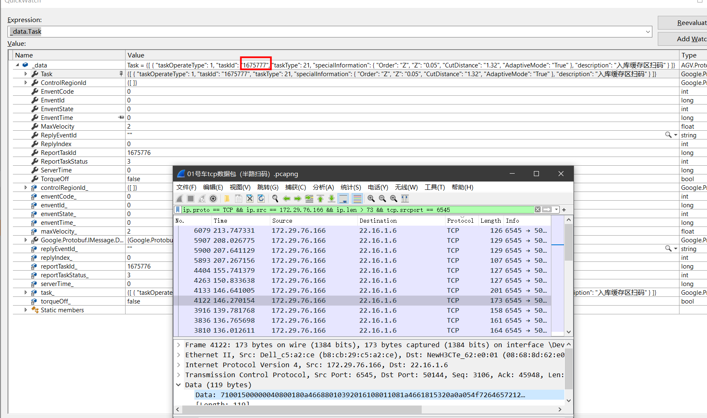
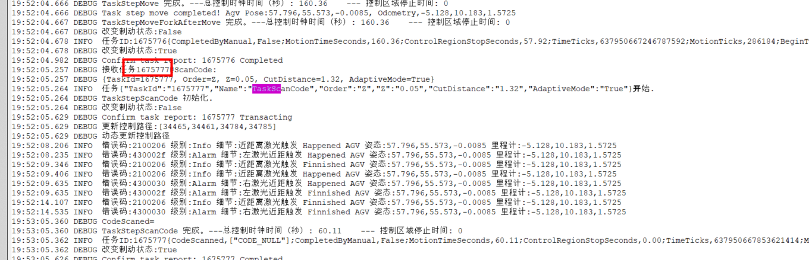

### 问题背景
RCS的同事找我排查扫码的问题，我查看日志Log, 发现是他们没有发送Path参数，有Path参数我们会先移动再扫码；没有Path参数则是原地扫码。

但是跟RCS反馈之后，他们说自己有发送Path，两周之后他们加了日志发给我；

我Check代码之后，发现Path就是直击读取ProtoBuf的数据，所以逻辑没问题，只要PotoBuf接收到数据我们就会打印。

但跟他们说话比较累，要么一句话需要反复说，或者反复解释，所以我决定让他们抓包，我直击分析出来让他们闭嘴；

### 分析WireShark数据
- 首先他们必须会使用WireShark记录数据，然后导出pacpng文件即可。
- 成功收到他们发送的pacpng文件
- <details> 
    <summary> 使用过滤条件，去除杂乱的信息 </summary>

    ``` bash
    ip.proto == TCP && ip.src == 172.29.76.166 && ip.len > 73 && tcp.srcport == 6545
    ```
    比较有意思的是直接tcp.srcport会全部过滤掉，而且TCP也必须是大写;

    解释一下，len > 73 凭经验判断是发送的数据一般会超过这个长度；

    然后发送的数据Tag必须是 PSH && ACK, 这个Tag搜索一下即可了解其含义。
</details>

- 收集并过滤后数据，就是如何解析二进制数据了
- <details>
    <summary>首先急速做一个单元测试的代码，将字符串解析为byte[]数组，将byte[]数组还原为Message消息。</summary>

    <details>
        <summary> 字符转为byte[]数组 </summary>
    
    ``` C#
        public static byte[] HexStringToByteArray(this string Hex)
        {
            byte[] Bytes = new byte[Hex.Length / 2];
            int[] HexValue = new int[] { 0x00, 0x01, 0x02, 0x03, 0x04, 0x05,
                0x06, 0x07, 0x08, 0x09, 0x00, 0x00, 0x00, 0x00, 0x00, 0x00, 0x00,
                0x0A, 0x0B, 0x0C, 0x0D, 0x0E, 0x0F };

            for (int x = 0, i = 0; i < Hex.Length; i += 2, x += 1)
            {
                Bytes[x] = (byte)(HexValue[Char.ToUpper(Hex[i + 0]) - '0'] << 4 |
                                    HexValue[Char.ToUpper(Hex[i + 1]) - '0']);
            }
            return Bytes;
        }
    ```

    </details>

    <details>
        <summary> 测试 </summary>
    
    ``` C#
        [DataRow("51001500000040800180a26688010292014108021080a26618032217aa9002a69002a79002929002a59002fce901beeb01d3363a1330303031414756e59b9ee58585e794b5e4bd8d4209a79002929002a590022cdb34ec")]
        [DataTestMethod]
        public void TestLoadData(string dataStr)
        {
            var data = dataStr.HexStringToByteArray();
            if (data != null && data.Length > 6)
            {
                var length = BitConverter.ToUInt16(data, 0);
                if (data.Length >= length + 6)
                {
                    var crc = CRC32.Compute(data, 2, length);
                    if (crc == BitConverter.ToUInt32(data, 2 + length))
                    {
                        try
                        {
                            Transact(data, 2, length);
                            return;
                        }
                        catch
                        {
                        }
                    }
                }
            }
        }

        private void Transact(byte[] data, int offset, int length)
        {
            using (var input = new MemoryStream(data, offset, length))
            {
                var _data = new CCDown();
                _data.MergeFrom(input);
                var _tasks = _data.Task.Select(Transform).ToList().AsReadOnly();
                var _controlRegionIds = _data.ControlRegionId.ToList().AsReadOnly();
            }
        }

        private static TaskOperate Transform(AGV.Protobuf.Task task)
        {
            return new TaskOperate()
            {
                TaskOperateType = (TaskOperateType)task.TaskOperateType,
                TaskId = task.TaskId,
                TaskType = (TaskType)task.TaskType,
                PathNos = task.PathNo.ToList().AsReadOnly(),
                CtrlPathNos = task.CtrlPathNo.ToList().AsReadOnly(),
                SpecialInformation = task.SpecialInformation.ToDictionary(),
                Cancelable = task.Cancelable,
            };
        }
    ```
    </details>

- 将得到数据截图发送给RCS，给足他们证据，减少扯皮

### 附图




