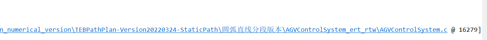

### 问题背景
控制组更新了一个算法，导致闪退必然发生，找到我帮忙给出一些细节的信息。

### 抓取crash dump
之前处理Crash问题的时候我有写了一个batch脚本抓取dump文件。
``` batch
procdump -e -t -ma AGV
pause
```
但是测试反馈说闪退了没抓到，我空白了一下立即想到，之前项目是32位的，我只发送了32位的Procdump;

本地测试了一下，不需要改动脚本，补发64位的procdump就可以了

### 分析dump

- 打开windbg64位，ctrl + d 打开dump, ctrl + s 设置pdb符号路径

- 输入 .ecxr ，（但我可能忘记了怎么拼写，可能想成了.ecxl, 这个时候输入.help即可跟进模糊印象找到对应命令，不用每次都网络搜索）

- 因为不知道什么原因，我这边输入 !analyze -v 会比较久 （所以选择 .ecxr + kb)

- kb查看当前堆栈信息，一般就是抛出异常的堆栈，没有加载pdb，看不到详细的代码文件和行号，加载Pdb之后即可


- 闪退的错误都是0xc000005非法地址访问错误

- 有点惊讶c的代码16k多行，后来了解到是matlab生成的代码


