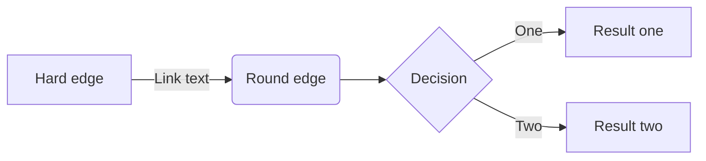
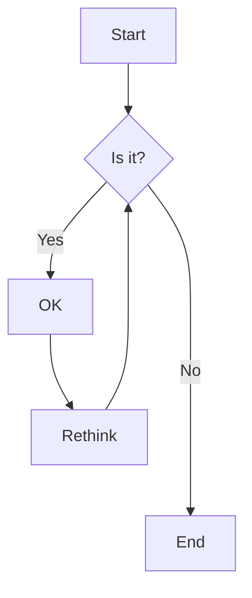
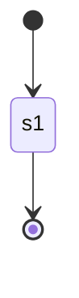
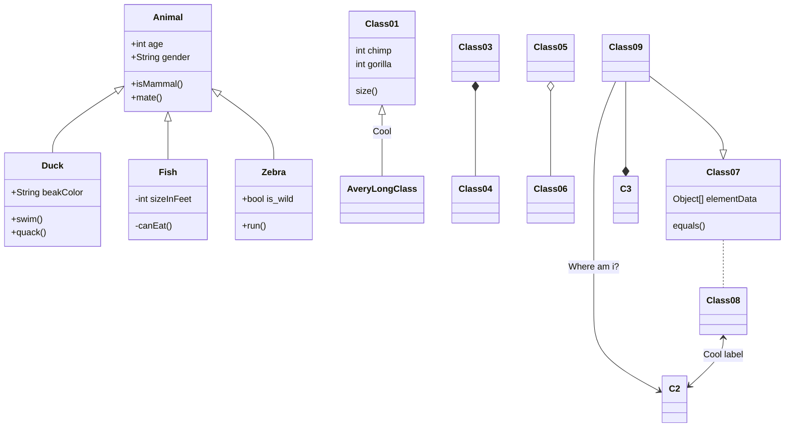
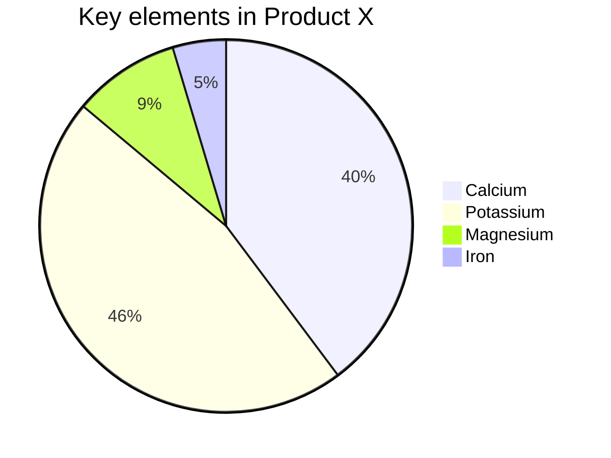
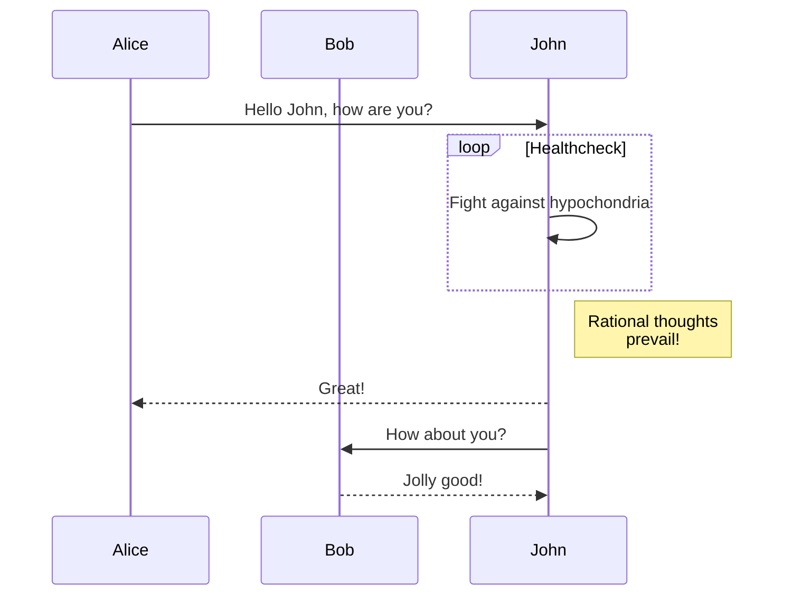
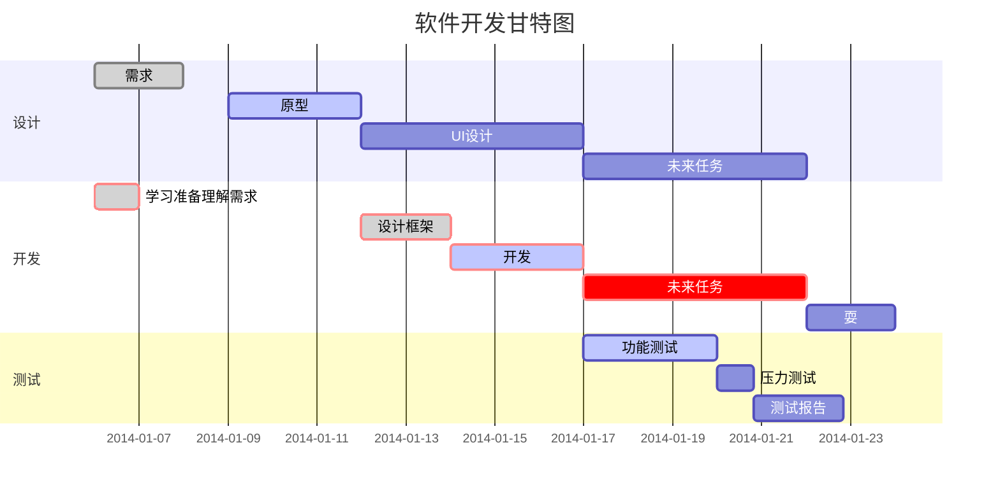
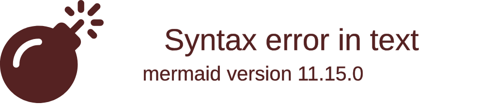
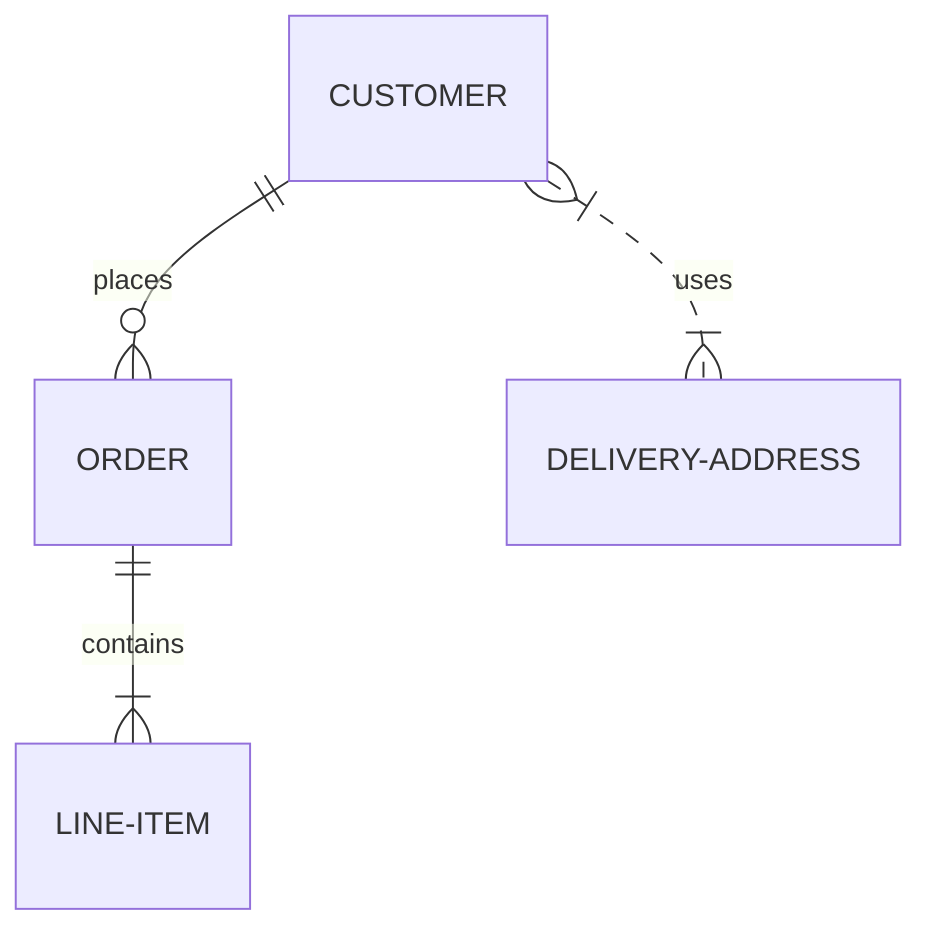
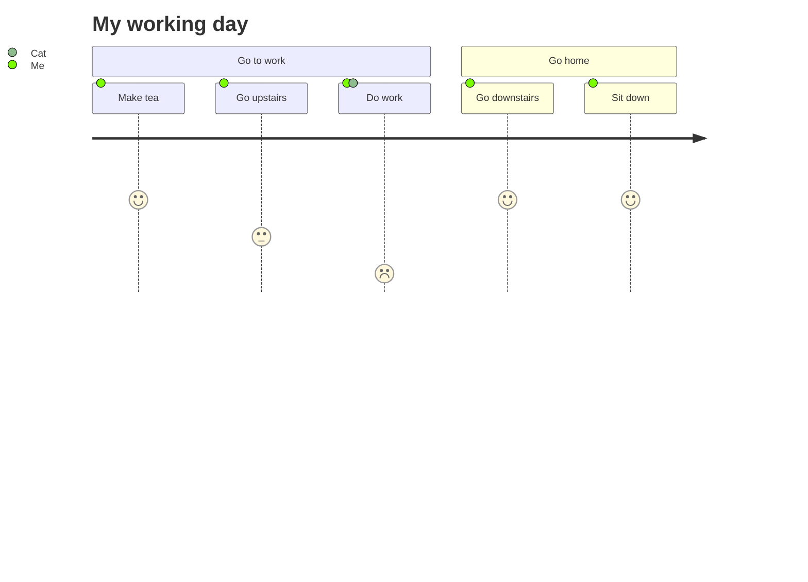

**流程图**([Flowchart](https://mermaid-js.github.io/mermaid/#/flowchart?id=flowcharts-basic-syntax))

竖向流程图

**状态图**

语法解释：`[*]` 表示开始或者结束，如果在箭头右边则表示结束。

**类图**

语法解释：`<|--` 表示继承，`+` 表示 `public`，`-` 表示 `private`。

**饼图**

饼图使用 `pie` 表示，标题下面分别是区域名称及其百分比。

**时序图**([Sequence diagram](https://mermaid-js.github.io/mermaid/#/sequenceDiagram))

**甘特图**([Gantt diagram](https://mermaid-js.github.io/mermaid/#/gantt))

### [Git graph](https://mermaid-js.github.io/mermaid/#/?id=git-graph-exclamation-experimental)

### [Entity Relationship Diagram ](https://mermaid-js.github.io/mermaid/#/entityRelationshipDiagram)

### [User Journey Diagram](https://mermaid-js.github.io/mermaid/#/user-journey)

